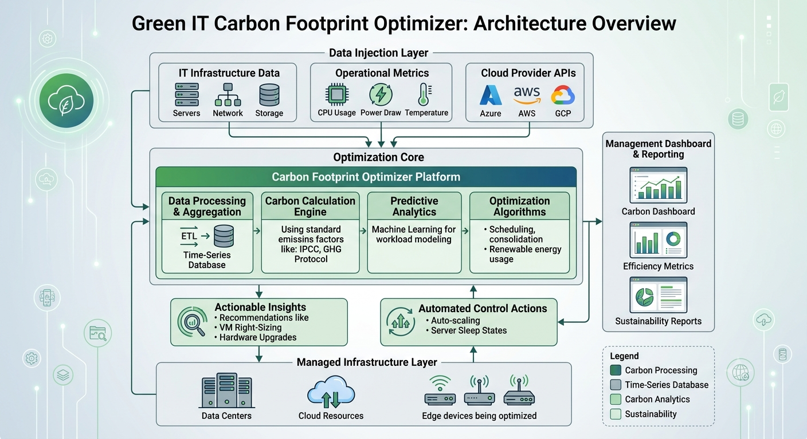

# Green IT Carbon Footprint Optimizer

## Overview

A **Spring Boot** based SaaS platform that monitors **Azure** cloud resource utilization, calculates real‑time carbon emissions using the public **cloud‑carbon‑footprint.org** API, stores time‑series metrics in **TimescaleDB**, and automatically rightsizes or powers down under‑utilized resources (both Azure VMs and Kubernetes workloads).  Metrics are exposed via **Micrometer** for **Prometheus/Grafana** visualization, and a minimal **Thymeleaf** UI provides compliance reporting.

---

## Architecture Diagram



---

## Features

- **Azure integration** – list VMs, AKS clusters, read utilization (placeholder) and perform scaling actions via Azure SDK v2.
- **Carbon emission calculation** – fetch region‑specific carbon intensity (kg CO₂e/kWh) from `cloud-carbon-footprint.org` and compute emissions.
- **Metrics** – Micrometer gauges for CPU, memory, carbon intensity and total emissions; scraped by Prometheus.
- **TimescaleDB** – efficient storage of time‑series `resource_metrics` and `autoscale_events`.
- **Autoscaling engine** – reactive polling (default every minute) that triggers scale‑down when utilization stays below a configurable threshold for a configurable duration.
- **Dashboard** – Thymeleaf UI (`/dashboard`) showing per‑resource utilization and carbon footprint.
- **Containerized deployment** – Docker image and Helm chart for Kubernetes.
- **Testing** – unit tests with Mockito and integration tests using Testcontainers (TimescaleDB).

---

## Quick Start (Local Development)

### Prerequisites

- **Java 21** (or newer)
- **Maven** (wrapper included)
- **Docker** (for TimescaleDB, Prometheus, Grafana)
- **Azure credentials** (service principal) exported as environment variables:
  ```bash
  export AZURE_CLIENT_ID=YOUR_CLIENT_ID
  export AZURE_CLIENT_SECRET=YOUR_CLIENT_SECRET
  export AZURE_TENANT_ID=YOUR_TENANT_ID
  export AZURE_SUBSCRIPTION_ID=YOUR_SUBSCRIPTION_ID
  ```

### Run with Docker Compose

```bash
cd green-it-optimizer
docker compose up --build
```

- The Spring Boot app will be reachable at `http://localhost:8080`.
- Prometheus will scrape `/actuator/prometheus` at `http://localhost:9090`.
- Grafana (default admin/admin) will be available at `http://localhost:3000` – import the provided `grafana-dashboard.json`.

### Stand‑alone Spring Boot Run

```bash
./mvnw spring-boot:run
```

The app will attempt to connect to a TimescaleDB instance defined in `application.yml`.  For a quick local DB you can start it with:

```bash
docker run -d --name tsdb -e POSTGRES_PASSWORD=secret -p 5432:5432 timescale/timescaledb:latest-pg15
```

---

## Building & Publishing Docker Image

```bash
./mvnw package -DskipTests
docker build -t your-registry/green-it-optimizer:latest .
# push to registry
docker push your-registry/green-it-optimizer:latest
```

---

## Deploying to Kubernetes with Helm

```bash
helm repo add green-it-optimizer ./helm/green-it-optimizer
helm install green-it-optimizer ./helm/green-it-optimizer \
  --set image.repository=your-registry/green-it-optimizer \
  --set image.tag=latest \
  --set azure.clientId=$AZURE_CLIENT_ID \
  --set azure.clientSecret=$AZURE_CLIENT_SECRET \
  --set azure.tenantId=$AZURE_TENANT_ID \
  --set azure.subscriptionId=$AZURE_SUBSCRIPTION_ID
```

Configuration options are documented in `helm/green-it-optimizer/values.yaml`.

---

## Configuration

All configurable properties live under the `greenit` namespace in `application.yml`:

```yaml
greenit:
  autoscale:
    poll-interval: 60000   # ms
    cpu-threshold: 0.15    # 15%
    underutilization-duration: PT30M
```

Environment variables (prefixed with `GREENIT_`) can override any property.

---

## Testing

### Unit Tests

```bash
./mvnw test
```

### Integration Tests (Testcontainers)

```bash
./mvnw verify -Pintegration
```

The integration profile spins up a TimescaleDB container and runs the `MetricsService` persistence test.

---

## Contributing

1. Fork the repository.
2. Create a feature branch.
3. Write tests for your changes.
4. Submit a Pull Request.

Please follow the **CODE_OF_CONDUCT.md** (included) and adhere to the licensing terms.

---

## License

This project is licensed under the **MIT License** – see the `LICENSE` file for details.

---

## Contact

For questions or feedback, open an issue or reach out to the maintainer at `sounyadeeps006@gmail.com`.
